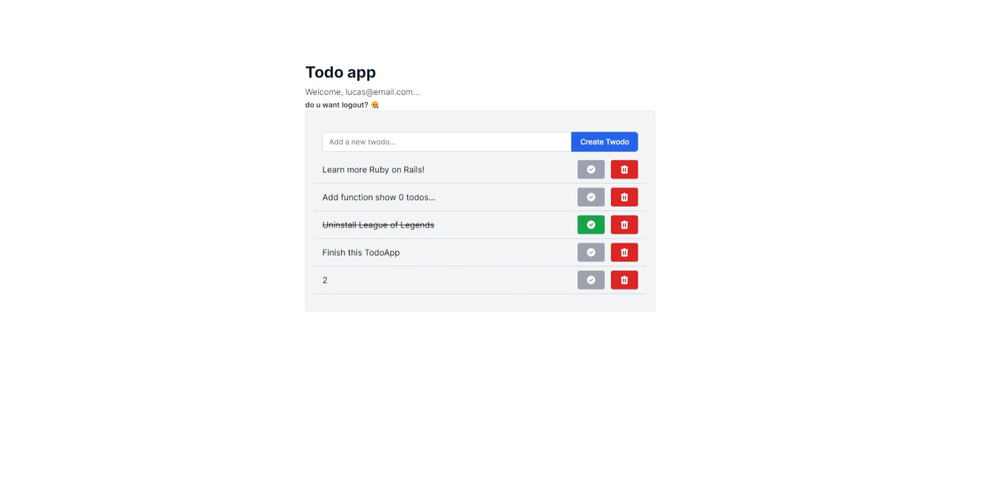
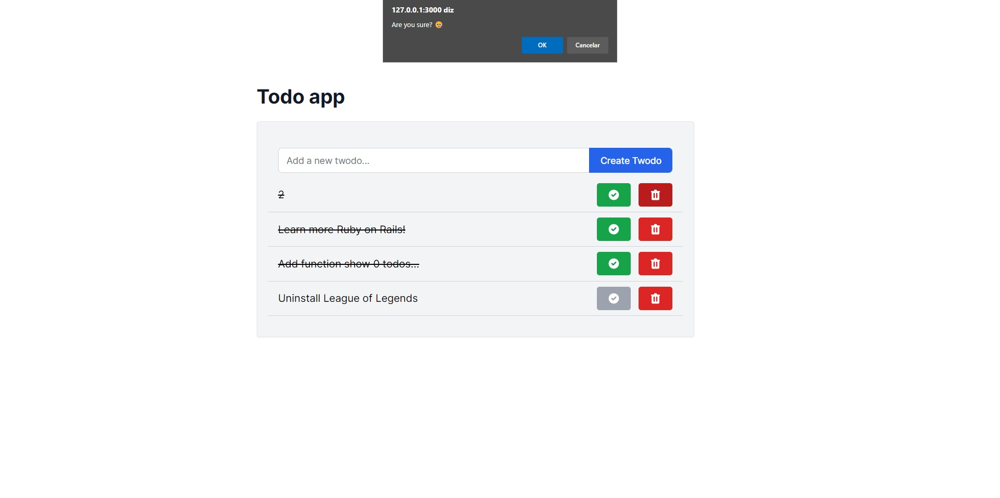
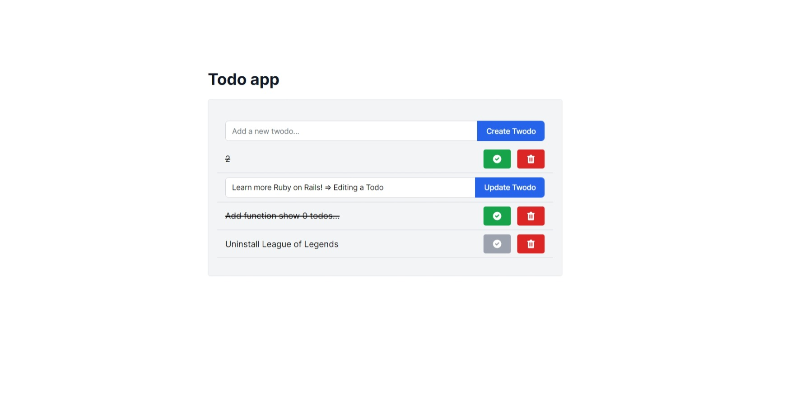

## Todo app
 
... A Todo app made with RoR, Tailwind, Turbo (rails 7), Postgresql
 
 
## Technology 
 
Here are the technologies used in this project.
 
* Ruby version 3.1.0
* Rails version 7.0.2
* TailwindCSS
* Postgresql
* Turbo-streams
 

 
## Ruby Gems
...
 
## Getting started
 
* To install gems:
>    $ bundle install
* To create the bank and do as migrations:
>    $ rake db:create db:migrate db:seed
* To run the project:
>    $ rails s
 
## Pages

* Index page
 
* Confirm delete 
 
* Edit a todo
 
* Sign-in and Sign-up pages
 
 =
 
 
 
## Version
 
1.0.0.0
